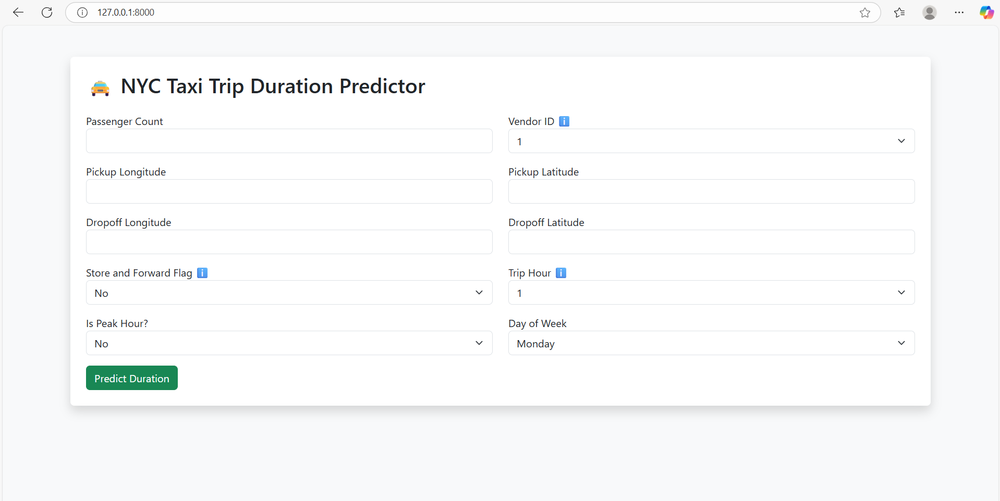
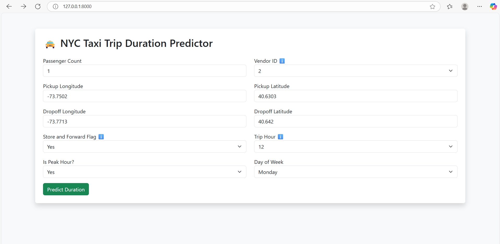
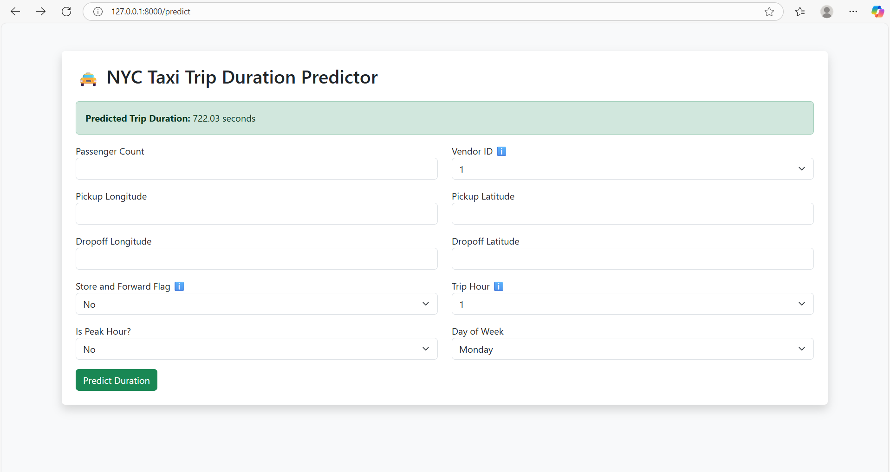
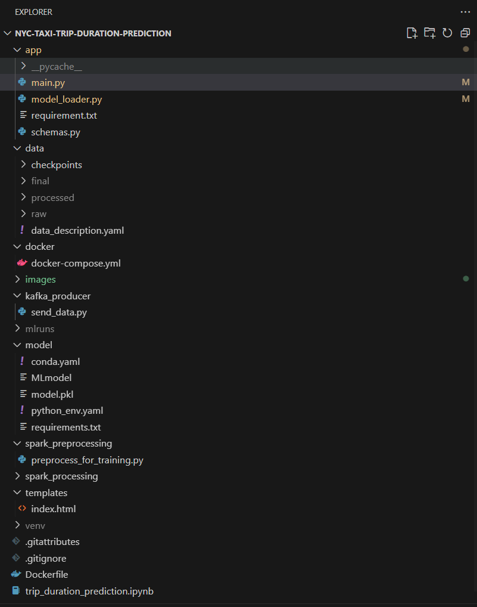

**🚖 NYC Taxi Trip Duration Prediction – ML Engineering Case Study**

**⚡ Unique Selling Point:**
This project bridges raw real-world data with modern ML Ops practices by turning a massive dataset into a real-time web prediction service using Spark, MLflow, FastAPI, Docker, and an intuitive UI.

**📌 Problem Statement**
Goal: Predict the trip duration (in seconds) of a NYC taxi ride based on ride characteristics like pickup/dropoff location, time of day, passenger count, etc.

**Why it matters:**
- For taxi companies and ride-sharing platforms, accurate trip time prediction improves:
- Customer satisfaction (accurate ETAs)
- Driver dispatch and planning
- Fare estimation

**Local Deployment SS:**
   - _Landing Page_
       
   - _Details for Prediction_
     
   - _Prediction_
     

**🧠 ML Workflow**
   1. Data Processing using PySpark
      
     - We processed large-scale NYC Yellow Taxi Trip data (~10M+ records) using Apache Spark.
     - Feature engineering included:
     - Extracting hour, day of week, peak hour flags
     - Calculating trip distance from coordinates
     - Cleaned nulls, outliers, and transformed categorical variables.
   
   2. Model Training & Logging
   
   - Trained a Ridge Regression model on curated features
   - Logged model with MLflow:
   - Tracked hyperparameters
   - Saved metrics and artifacts
   - Versioned the trained model for reproducibility
   
   3. Model Serving & Frontend (FastAPI)
   
   - Developed a backend using FastAPI with form-based UI:
   - HTML templates using Jinja2
   - Input fields for ride data
   - Predict button returns trip duration
   - Showcases real-time inference powered by a pre-trained MLflow model.
   
   4. Containerization with Docker
   
   - Packaged everything into a single Docker image:
   - FastAPI server
   - Model loader
   - Static assets
   - Used Dockerfile and .dockerignore for efficient image builds

**📷 Project Screenshots**

- Due to model size, full hosting isn’t shown. Below are local screenshots:
- ✅ Home UI: Form to input trip details
- ✅ Prediction UI: Displays predicted trip time
- ✅ MLflow UI: Experiment tracking
- ✅ Spark Preview: Data transformation steps

**🧰 Tech Stack**
   - Tool	                           Usage
   - Apache Spark	         Distributed data preprocessing
   - MLflow	               Model tracking and versioning
   - Scikit-learn	         ML model (Ridge Regression)
   - FastAPI	               REST API + Web UI
   - Jinja2	               Templating HTML forms
   - Docker	               Containerization
   - Pandas/Numpy	         Data manipulation

**🧪 Key Features**
   - 🔍 Handles real-world scale NYC taxi dataset
   - 🚀 Supports real-time predictions
   - 🎯 Implements full ML lifecycle:
   - Data → Model → Serve → Predict
   - 🐳 Production-ready with Docker
   - 📚 Easily extendable to other models or inputs

**⚙️ How to Run Locally**
   - Make sure you have Docker and Python 3.10+ installed.
   
   - 🔧 Setup
      - Clone the repo
         - git clone https://github.com/your-username/nyc-taxi-duration-predictor.git
         - cd nyc-taxi-duration-predictor
      
      - (Optional) Create virtual environment
         - python -m venv venv
         - source venv/bin/activate  # or venv\Scripts\activate
      
      - Install dependencies
      - cd app
      - pip install -r requirements.txt
      
      - Run the app
         - uvicorn app.main:app --reload
      
      - Visit in browser
         - http://127.0.0.1:8000
      
      - 🐳 Run with Docker
         - docker build -t nyc-taxi-app .
         - docker run -p 8000:8000 nyc-taxi-app
         - Then open http://localhost:8000

**📂 Project Structure**
     Projectstructure
     
     
**🚧 Limitations & Future Work**
- 🔒 Model not hosted online due to size limits
- 🔄 Can integrate with PostgreSQL or cloud DB for logging inputs
- 📊 Extend UI with charts for insights
- 🤖 Support for multiple models or Deep Learning options
